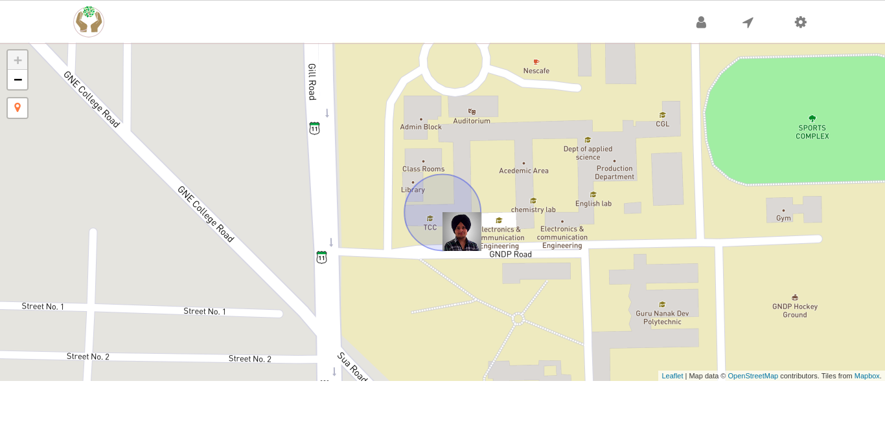
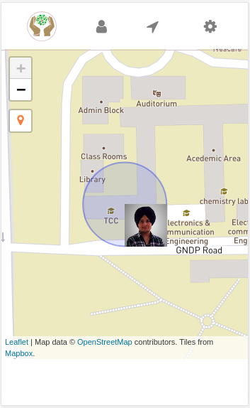

:title: Amritpal Singh 
:data-transition-duration: 1500
:css: hovercraft.css

*parupkaar.org*
===================================

Jagjeet Singh - 1411266

Amritpal Singh - 1411234

Abhinav Handa - 1411227

Harnarinder Singh - 1411262

----

Before starting, I want to acknowledge **Dr. Kiran Jyoti** (Assistant Professor, at Guru Nanak Dev Engineering College)

----

**parupkaar.org** is an non-profit organization with the aim to provide volunteers to help anyone. We will provide a platform where altruist meets the needy. Our main **motive** is to help the masses without any inconsiderate motives.

----

Existing system
==================

Right now, there is no online platform which can show all the live volunteers in a area and people who provide the same service usually charge some money to the NGO’s.

----

Proposed solution to the problem
====================================

We are going to provide a platform where people can openly contribute either as a volunteer or donator.

----

Objectives
==========================

----

:data-x: r0
:data-y: r+1000

**parupkaar.org** will let volunteers create their profile and will connect them to others. By letting people see location of volunteers in a particular area, a connection will be established so that needy people can be helped.

----

:data-x: r0
:data-y: r+1000

Everyone who feels like helping others will use our product, volunteers who wish to act as a medium between donator and needy.

----

:data-x: r0
:data-y: r+1000

Others will be the donators themselves, who wish to help in any kind. Also other N.G.O’s
can be contacted to widen the users.

----

:data-x: r+1500
:data-y: r-3000

**Web view**

----

:data-x: r+1500
:data-y: r0

**Mobile view**

----

With this, I complete my presentation.
=======================================

* **Source Code**: https://github.com/iamjagjeetubhi/parupkaar.org 

----

Thank you...
=============
